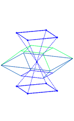
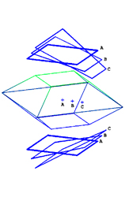
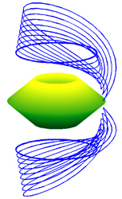
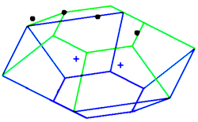
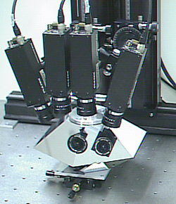
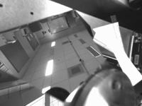
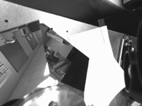
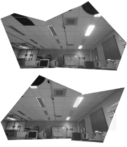
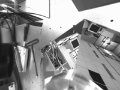
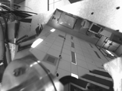

---
# You don't need to edit this file, it's empty on purpose.
# Edit theme's home layout instead if you wanna make some changes
# See: https://jekyllrb.com/docs/themes/#overriding-theme-defaults
layout: default
---

# Multiview Mirror Pyramid Panoramic Cameras

Panoramic images and video are useful in many applications 
such as special effects, immersive virtual reality environments, and video 
games. Among the numerous devices proposed for capturing panoramas, mirror 
pyramid-based camera systems are a promising approach for video rate 
capture, as they offer single-viewpoint imaging, and use only flat mirrors 
that are easier to produce than curved mirrors. To date, the designs 
proposed typically capture panoramas from a single viewpoint. 

A mirror pyramid consists of a set of flat mirror faces arranged around 
an axis of symmetry, inclined to form a pyramid. By strategically 
positioning a number of conventional cameras around a mirror pyramid, the 
viewpoints for the individual cameras’ mirror images can be colocated at a 
single point within the pyramid, effectively forming a virtual camera with 
a wide field of view.

Mirror pyramid-based panoramic cameras have a number of attractive 
properties, including

   * single-viewpoint imaging 
   * high resolution, and 
   * video rate capture

Previous designs realize a single viewpoint within each 
mirror pyramid. In order to capture panoramas from multiple viewpoints 
with these designs, the entire physical setup would need to be relocated 
or duplicated. The former solution lacks the capability of video rate 
imaging, and the latter leads to bulky designs due to the multiple mirror 
pyramids.

In our paper we proposed a method for generalizing existing designs 
such that multiple viewpoints can be created in a single mirror pyramid. 
This enables simultaneous multiview panoramic video rate imaging with a 
compact design. 

<table width=600>
  <TR>
    <TD align=middle> </TD>
    <TD align=middle> </TD>
    <TD align=middle> </TD></TR>
  <TR>
    <TD align=middle>(a) </TD>
    <TD align=middle>(b) </TD>
    <TD align=middle>(c) </TD></TR>
  <TR>
    <TD align=left colSpan=3>Figure 1. Variation in the physical camera 
      position with viewpoint position. (a) Viewpoint is centered in four-sided 
      pyramid, shown with the corresponding eight camera positions. (b) 
      Translated viewpoints marked A, B, and C are shown with correspondingly 
      marked physical camera positions. (c) Same as (b), but with a mirror 
      pyramid with a large number of faces to show how the shape changes as the 
      viewpoint translates. 
      
&nbsp;
</TD></TR
</table>

## Experiments

<table cellSpacing=0 cellPadding=0 width=600>
  

  <TR>
    <TD align=middle>
      

</TD>
    <TD align=middle>&nbsp; </TD></TR>
  <TR>
    <TD align=middle>(a) </TD>
    

    <TD align=middle>(b) </TD>
  <TR>
    <TD align=left colSpan=2>
      
Figure 2. The experimental multiview panoramic camera. (a) 
      The conceptual design. (b) The physical implementation utilizing four 
      cameras and two mirror faces to produce two views. 
      
&nbsp;
</TD></TR>
</table>
      
<table height=433 cellSpacing=2 cols=2 cellPadding=0 width=640>
  <TR>
    <TD>
      <H2>Results</H2></TD>
    <TD></TD>
    <TD align=right>
      
[<A 
      href="http://vision.ai.uiuc.edu/~tankh/Camera/camera.html#top">back to 
      top</A>] 
</TD></TR>
  <TR>
    <TD vAlign=bottom align=middle height=152></TD>
    <TD vAlign=bottom align=middle height=152></TD>
    <TD vAlign=bottom align=middle height=304 rowSpan=2></TD></TR>
  <TR>
    <TD align=middle height=152> </TD>
    <TD align=middle height=152> </TD></TR>
  <TR>
    <TD align=middle colSpan=2 height=24>(a)</TD>
    <TD vAlign=bottom align=middle height=24>(b)</TD></TR>
  <TR>
    <TD align=middle colSpan=3 height=18>
      
Figure 3. Experimental results. (a) Images captured by the 
      four conventional cameras, after correcting for radial distortion. (b) The 
      mosaiced views.
</TD></TR>
</table>      

## Collaborators
[Hong Hua](https://wp.optics.arizona.edu/3dvis/people/dr-hong-hua/)

[Narendra Ahuja](http://vision.ai.illinois.edu/ahuja.html)

## Publications
1. Kar-Han Tan, Hong Hua and Narendra Ahuja, "Multiview panoramic cameras using mirror pyramids," in IEEE Transactions on Pattern Analysis and Machine Intelligence, vol. 26, no. 7, pp. 941-946, July 2004. [DOI](http://dx.doi.org/10.1109/TPAMI.2004.33)  [PDF](/Publication/tan2004multiview.pdf)

2. Kar-Han Tan, Hong Hua and Narendra Ahuja, "Multiview panoramic cameras using a mirror pyramid," Third Workshop on Omnidirectional Vision, pp. 87-93, 2002. [DOI](http://dx.doi.org/10.1109/OMNVIS.2002.1044501)

## Citation
    @ARTICLE{tan2004multiview,
    author={Kar-Han Tan and Hong Hua and Narendra Ahuja},
    journal={IEEE Transactions on Pattern Analysis and Machine Intelligence},
    title={Multiview panoramic cameras using mirror pyramids},
    year={2004},
    volume={26},
    number={7},
    pages={941-946},
    keywords={image resolution;image sensors;mirrors;stereo image processing;video cameras;FOV;cameras mirror images;field of         view;image resolution;imaging geometry;mirror pyramid cameras;multiview panoramic cameras;optical axes;panoramic video rate imaging;planar mirror faces;sensor utilization;single viewpoint imaging;symmetry axis;video rate capture;virtual camera;Cameras;Design methodology;Geometry;High-resolution imaging;Image resolution;Mirrors;Optical imaging;Optical sensors;Prototypes;Solid modeling;Panoramic cameras;catadioptric systems;mirror pyramids;multiview panoramic imaging;omnidirectional imaging and video capture;stereoscopic cameras.;Algorithms;Artificial Intelligence;Image Enhancement;Image Interpretation, Computer-Assisted;Imaging, Three-Dimensional;Pattern Recognition, Automated;Photography},
    doi={10.1109/TPAMI.2004.33},
    ISSN={0162-8828},
    month={July},}
