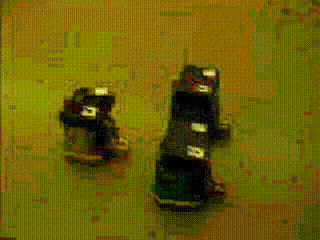

# Virtual Structures Robotic Formation Control



1.  Tan, Kar-Han; Lewis, M Anthony;  Virtual structures for high-precision cooperative mobile robotic control. Intelligent Robots and Systems' 96, IROS 96, Proceedings of the 1996 IEEE/RSJ International Conference on. vol. 1 pp.132-139. 1996. [full text](/Publications/KarHanTan1996Virtual.pdf)
1.  Zhen, Jian L.; Lewis, M. A.; Tan, Kar-Han;  Towards universal access to robotic resources. Intelligent Robots and Systems '96, IROS 96, Proceedings of the 1996 IEEE/RSJ International Conference on. vol. 3 pp.1400-1407. 1996. [full text](/Publications/KarHanTan1996Towards.pdf)
1.  Lewis, M Anthony; Tan, Kar-Han;  High precision formation control of mobile robots using virtual structures. Autonomous robots. 4(4):387-403. 1997. [full text](/Publications/KarHanTan1997High.pdf)


```
@INPROCEEDINGS{ref:KarHanTan1996Virtual, 
author={Kar-Han Tan and M. A. Lewis}, 
booktitle={Intelligent Robots and Systems '96, IROS 96, Proceedings of the 1996 IEEE/RSJ International Conference on}, 
title={Virtual structures for high-precision cooperative mobile robotic control}, 
year={1996}, 
volume={1}, 
pages={132-139 vol.1}, 
keywords={cooperative systems;digital simulation;intelligent control;mobile robots;motion control;geometric configuration;high precision movement;high-precision cooperative mobile robotic control;robot ensemble;virtual structures;Computer science;Degradation;Force control;Mobile robots;Motion control;Orbital robotics;Robot control;Robot kinematics;Testing;Transportation}, 
doi={10.1109/IROS.1996.570643}, 
month={Nov},
note={\url{https://karhantan.com/VirtualStructures } }
}

@Article{ref:KarHanTan1997High,
author="Lewis, M. Anthony
and Tan, Kar-Han",
title="High Precision Formation Control of Mobile Robots Using Virtual Structures",
journal="Autonomous Robots",
year="1997",
month="Oct",
day="01",
volume="4",
number="4",
pages="387--403",
issn="1573-7527",
doi="10.1023/A:1008814708459",
note={\url{https://karhantan.com/VirtualStructures } }
}
```

